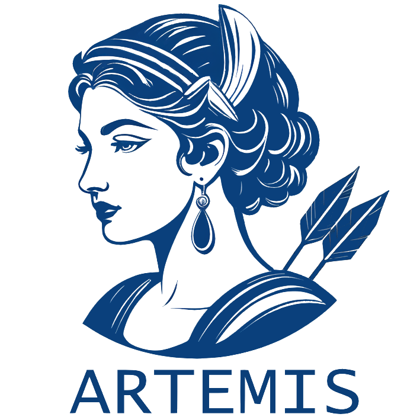

<p float="left">



</p>

## Overview

ARTEMIS provides an interface to a modified Temporal Smith–Waterman (TSW) algorithm, adapted from the approach presented in [10.1109/DSAA.2015.7344785](https://www.researchgate.net/publication/292331949_Temporal_Needleman-Wunsch). This algorithm transforms longitudinal EHR data into discrete regimen eras.
Although applicable to various contexts, ARTEMIS is primarily intended for cancer patients and uses regimen definitions sourced from the [`HemOnc`](https://hemonc.org/wiki/Main_Page) oncology reference.


<figure>

<figcaption aria-hidden="true">ARTEMIS Workflow</figcaption>
</figure>

### Quick to Docs:
* See [release notes](docs/branch-versioning.md) for versioning and contribution.

## Installation

Before installing ARTEMIS, ensure that **Python (version ≥ 3.12)** is installed on your system.  
You can check which Python version R detects using:

```r
system("python --version", intern = TRUE)
```

If you want ARTEMIS to use a specific Python interpreter, set the `ARTEMIS_PYTHON` environment variable before installation:

```r
Sys.setenv(ARTEMIS_PYTHON = "/path/to/your/python")
```

ARTEMIS can be installed directly from GitHub:

```r
# Install devtools if it is not already installed
if (!requireNamespace("devtools", quietly = TRUE)) {
  install.packages("devtools")
}

# Install ARTEMIS from GitHub
devtools::install_github("OHDSI/ARTEMIS")
```

## Usage

A user script is included in this repository,`userScript.R`, to demonstrate how ARTEMIS works. It uses a dummy database to create patients and align them with treatment regimens. Instructions for connecting to your CDM are provided in the next section.

### Input

An input JSON file containing a cohort specification is provided by the user. Information on OHDSI cohort creation and best practices can be found [here](https://ohdsi.github.io/TheBookOfOhdsi/Cohorts.html). An example cohort selecting patients with NSCLC is included with the package.

    df_json <- loadCohort()
    json <- df_json$json[1]
    name <- "examplecohort"

    # Manual
    # json <- CDMConnector::readCohortSet(path = here::here("myCohort/"))
    # name <- "customcohort"


Regimen data may be loaded in from the provided package, or may be
submitted directly by the user. All of the provided regimens will be
tested against all patients within a given cohort.

    regimens <- loadRegimens(condition = "all")
    regGroups <- loadGroups()

    # Manual
    # regimens <- read.csv("/path/to/my/regimens.csv")

A set of valid drugs may be loaded from the provided data or curated and submitted by the user. Only valid drugs will appear in processed patient strings. Therefore, any drugs not included in this list will not affect alignment. Drugs that are frequently taken outside of chemotherapy regimens, such as antiemetics, should not be included.

    validDrugs <- loadDrugs()

    # Manual
    # validDrugs <- read.csv(here::here("data/myDrugs.csv"))

### Pipeline

The cdm connection is used to generate a dataframe containing the
relevant patient details for constructing regimen strings.

    con_df <- getConDF(connectionDetails = connectionDetails, 
                       json = json, 
                       name = name, 
                       cdmSchema = cdmSchema, 
                       writeSchema = writeSchema)

Regimen strings are then constructed, collated and filtered into a
stringDF dataframe containing all patients of interest.

    stringDF <- stringDF_from_cdm(con_df = con_df, validDrugs = validdrugs)

The TSW algorithm is then run using user input settings and the provided
regimen and patient data. Detailed information on user inputs, such as
the gap penalty `g`, can be found [here](www.github.com/OHDIS/ARTEMIS).

    ra <- stringDF %>% 
        generateRawAlignments(regimens = regimens)

Raw alignments are subsequently post-processed. These steps include resolving overlapping regimen alignments and formatting the output for line-of-treatment assignment.

    pa <- ra %>% 
            processAlignments(regimenCombine = 28, regimens = regimens)


Individual patient regimens can be visualized using `plotAlignment`.

```
p <- plotAlignment(pa)
p
```

<figure>

<figcaption aria-hidden="true">Visualization of Aligned Regimens</figcaption>
</figure>


Data may then be further explored via several graphics which indicate
various information, such as regimen frequency or the score/length
distributions of a given regimen.

    plotFrequency(pa)
    plotScoreDistribution(pa)
    plotRegimenLengthDistribution(pa)

These functions display the most frequent regimens, but additional regimens can also be specified.

    plotScoreDistribution(pa, components = c("Pembrolizumab monotherapy"))
    plotRegimenLengthDistribution(pa, components = c("Pembrolizumab monotherapy"))


Finally, basic statistics is providedy by: 

    regStats <- processedEras %>% g
            enerateRegimenStats()


### DatabaseConnector

ARTEMIS also relies on the package [DatabaseConnector](https://github.com/OHDSI/DatabaseConnector) to create a connection to your CDM. Cohort creation requires a valid schema containing data and a pre-existing schema with write access. This write schema is used to store cohort tables during their generation and can be safely deleted after running the package.


The specific drivers required by dbConnect may change depending on your
system. More detailed information can be found in the section “DBI
Drivers” at the bottom of this readme.


If the OHDSI package [CirceR](https://github.com/OHDSI/CirceR) is not already installed on your system, you may need to install it directly from the OHDSI/CirceR GitHub page, as it is a non-CRAN dependency required by CDMConnector. You may similarly need to install the [CohortGenerator](https://github.com/OHDSI/CohortGenerator) package directly from GitHub.

    #devtools::install_github("OHDSI/CohortGenerator")
    #devtools::install_github("OHDSI/CirceR")

    connectionDetails <- DatabaseConnector::createConnectionDetails(dbms="redshift",
                                                                    server="myServer/serverName",
                                                                    user="user",
                                                                    port = "1337",
                                                                    password="passowrd",
                                                                    pathToDriver = "path/to/JDBC_drivers/")

    cdmSchema <- "schema_containing_data"
    writeSchema <- "schema_with_write_access"


## Getting help

If you encounter a clear bug, please file an issue with a minimal
[reproducible example](https://reprex.tidyverse.org/) at the [GitHub
issues page](https://github.com/OHDSI/ARTEMIS/issues).
